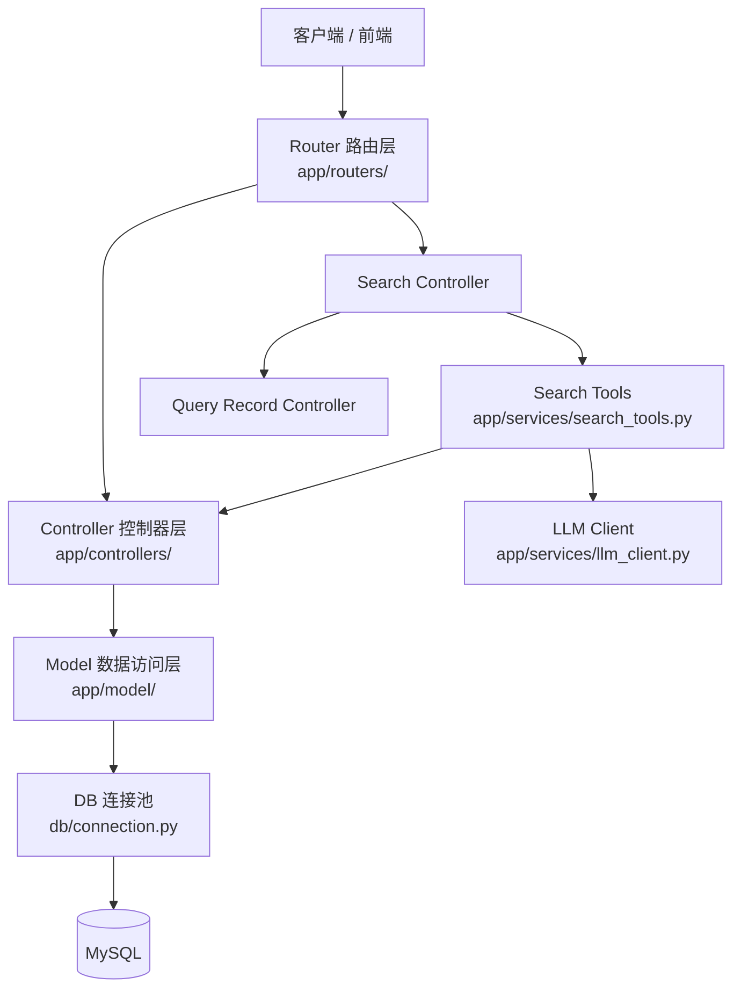
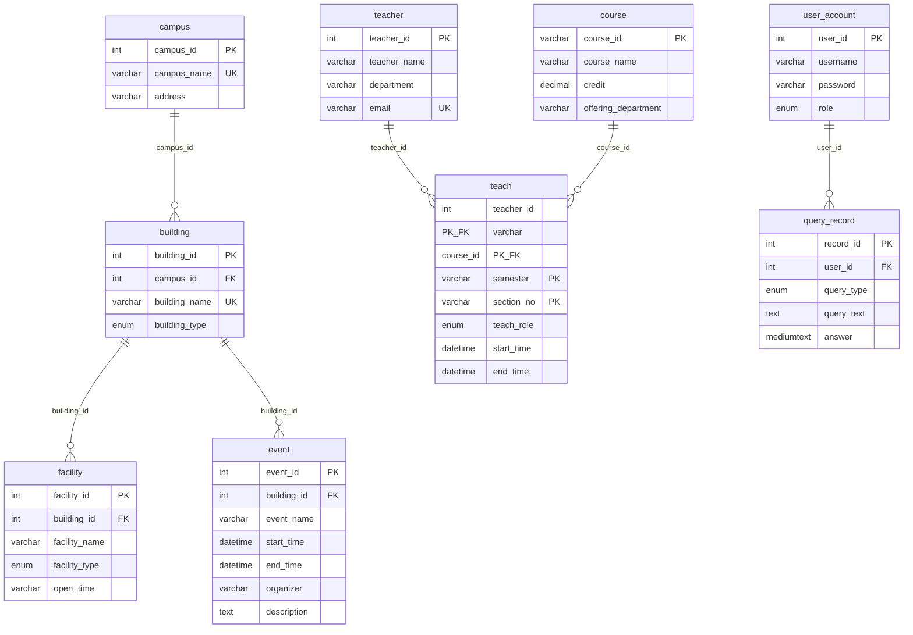
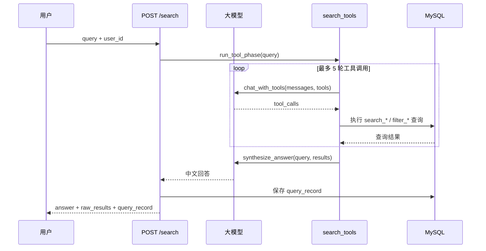

# DBDesignPy

校园信息数据库管理系统后端 API。基于 FastAPI 构建，提供校区、建筑、设施、课程、活动、教师等实体的增删改查，并支持通过大语言模型（LLM）进行自然语言查询。

## 功能概览

- **实体管理**：校区、建筑、设施、课程、活动、教师、授课记录的 CRUD 与搜索
- **双模式查询**：`search`（模糊 LIKE）与 `filter`（精确 IN 多值匹配）
- **用户认证**：注册、登录、账号更新（PBKDF2-SHA256 密码哈希）
- **查询记录**：保存关键词与自然语言查询历史
- **自然语言搜索**：LLM 工具调用自动选择查询接口，并生成中文回答

## 技术栈

| 类别 | 技术 |
|------|------|
| 语言 | Python 3.12+ |
| Web 框架 | FastAPI + Uvicorn |
| 数据校验 | Pydantic v2 |
| 数据库 | MySQL 8.x（`mysql-connector-python` 连接池） |
| 大模型 | OpenAI 兼容 API（`openai` SDK） |
| 配置 | `python-dotenv`（`.env`） |

## 系统架构

项目采用分层架构，请求自上而下流经各层，数据访问统一通过 `db.connection` 连接池执行 SQL。



### 目录结构

```
DBDesignPy/
├── app/
│   ├── main.py              # FastAPI 应用入口
│   ├── exception_handlers.py
│   ├── list_search.py       # SQL LIKE / IN 查询辅助
│   ├── routers/             # 路由注册与 URL 映射
│   ├── controllers/         # 业务逻辑与响应封装
│   ├── model/               # 数据库 CRUD
│   ├── type/                # Pydantic 请求/响应模型
│   └── services/
│       ├── llm_client.py    # 大模型调用
│       └── search_tools.py  # 自然语言搜索工具定义与编排
├── db/
│   └── connection.py        # MySQL 连接池与 run() 执行器
├── data/                    # 初始化种子 CSV 数据
├── dbInitial.py             # 建表 + 导入种子数据
├── requirements.txt
├── .env.example
```

### 分层职责

| 层级 | 职责 |
|------|------|
| **Router** | 定义 HTTP 路径、请求体类型，调用 Controller |
| **Controller** | 业务校验、组装 `ApiResponse`（`success` / `code` / `message` / `data`） |
| **Model** | 编写 SQL，通过 `db.run()` 读写数据库 |
| **Type** | Pydantic 模型，定义 API 入参出参结构 |
| **Services** | 跨领域能力（LLM 调用、自然语言工具编排） |

### 统一响应格式

所有接口返回 `ApiResponse`：

```json
{
  "success": true,
  "code": 200,
  "message": null,
  "data": { }
}
```

## 数据库设计

共 9 张表，实体间通过外键关联：



**枚举值说明：**

- `building_type`：教学楼、宿舍楼、办公楼、实验楼、体育馆、食堂、图书馆、其他
- `facility_type`：餐厅、水吧、自习室、办公室、卫生间、教室、寝室、其他
- `teach_role`：教师、助教
- `user_account.role`：user、admin
- `query_record.query_type`：keyword、natural_language

## API 概览

| 模块 | 前缀 | 主要端点 |
|------|------|----------|
| 认证 | `/auth` | `POST /register` `POST /login` `POST /update` |
| 校区 | `/campus` | `upload` `search` `filter` `update` `remove` |
| 建筑 | `/building` | 同上 |
| 设施 | `/facility` | 同上 |
| 课程 | `/course` | 同上 |
| 活动 | `/event` | 同上 |
| 教师 | `/teacher` | 同上 |
| 授课 | `/teach` | `upload` `search` `filter` `update` `remove` |
| 查询记录 | `/query_record` | 同上 |
| 自然语言搜索 | `/search` | `POST /search` |

启动服务后可访问：

- Swagger UI：`http://127.0.0.1:8000/docs`
- ReDoc：`http://127.0.0.1:8000/redoc`
- OpenAPI JSON：`http://127.0.0.1:8000/openapi.json`

也可将根目录 `openapi.json` 导入 Apifox / Postman，或通过脚本重新生成：

```bash
python scripts/export_openapi.py
```

### 自然语言搜索流程



## 快速开始（本地开发）

### 环境要求

- Python 3.12+
- MySQL 8.x（已创建空数据库）

### 1. 克隆与安装依赖

```bash
git clone <仓库地址>
cd DBDesignPy

python -m venv .venv

# Windows
.venv\Scripts\activate

# Linux / macOS
source .venv/bin/activate

pip install -r requirements.txt
```

### 2. 配置环境变量

复制示例文件并填写实际值：

```bash
cp .env.example .env
```

| 变量 | 说明 | 示例 |
|------|------|------|
| `DB_HOST` | 数据库地址 | `127.0.0.1` |
| `DB_PORT` | 数据库端口 | `3306` |
| `DB_USER` | 数据库用户名 | `root` |
| `DB_PASSWORD` | 数据库密码 | `your_password` |
| `DB_NAME` | 数据库名 | `campus_db` |
| `DB_POOL_SIZE` | 连接池大小（可选，默认 8） | `8` |
| `LLM_API_KEY` | 大模型 API Key | `sk-...` |
| `LLM_BASE_URL` | 大模型 API 地址（可选） | `https://api.openai.com/v1` |
| `LLM_MODEL` | 模型名称（可选） | `gpt-4o-mini` |

### 3. 初始化数据库

`dbInitial.py` 会建表并在数据库为空时从 `data/*.csv` 导入种子数据：

```bash
python dbInitial.py
```

### 4. 启动开发服务器

```bash
uvicorn app.main:app --reload --host 127.0.0.1 --port 8000
```